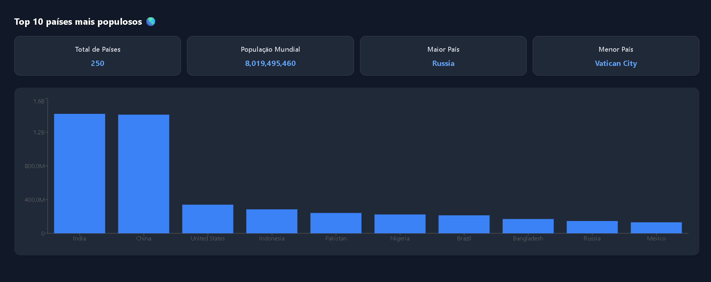
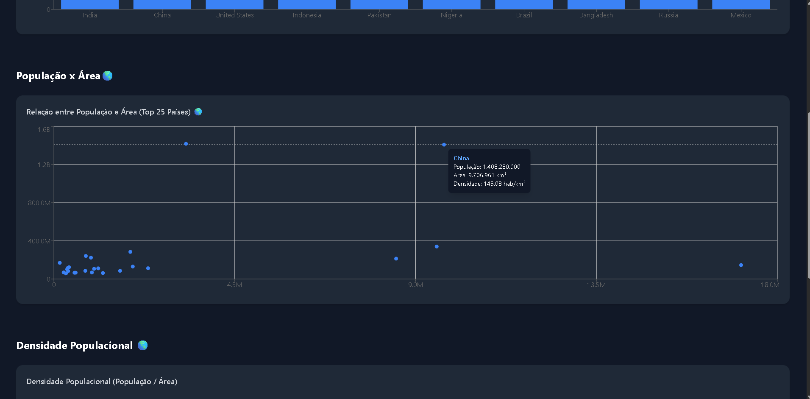

# 🌍 React Dashboard - Country Data Insights

Um **dashboard interativo de dados** desenvolvido com **React + TypeScript + TailwindCSS + Recharts**, que consome a [REST Countries API](https://restcountries.com/) e exibe visualizações sobre países — incluindo **população, área e densidade populacional**.

O objetivo do projeto é demonstrar domínio em tecnologias front-end modernas e boas práticas de componentização, tipagem e consumo de APIs públicas.

---

## 🚀 Tecnologias Utilizadas

| Tecnologia | Descrição |
|-------------|------------|
| **React + Vite** | Framework para criação da interface e build rápido. |
| **TypeScript** | Superset de JavaScript com tipagem estática. |
| **TailwindCSS** | Framework utilitário para estilização responsiva. |
| **Recharts** | Biblioteca para gráficos reativos em React. |
| **REST Countries API** | Fonte pública de dados sobre países. |

---

📈 Exemplo de Visualizações

Top 10 países mais populosos


População x Área (Top 25 países)


Densidade Populacional (Top 25 países)


---

## 📊 Funcionalidades

✅ **Dashboard Responsivo** com layout limpo e intuitivo  
✅ **Consumo dinâmico de dados** via hook `useCountries`  
✅ **Gráficos interativos com Recharts**:
  - Top 10 países mais populosos  
  - Relação entre **população x área** (Top 25 países)  
  - Ranking de **densidade populacional**  
✅ **Tooltips personalizados** com informações detalhadas  
✅ **Boas práticas de componentização e tipagem com TS**

---

## 🧱 Estrutura de Pastas

src/
├─ components/ → Gráficos e cards reutilizáveis
│ ├─ SummaryCards.tsx
│ ├─ CountryChart.tsx
│ ├─ PopulationAreaChart.tsx
│ └─ PopulationDensityChart.tsx
│
├─ hooks/ → Hooks personalizados
│ └─ useCountries.ts
│
├─ pages/ → Páginas principais
│ └─ Dashboard.tsx
│
├─ styles/ → Configuração do Tailwind
├─ main.tsx → Ponto de entrada do app
└─ App.tsx

---

## ⚙️ Como Executar o Projeto

### 1️⃣ Clone o repositório
```bash
git clone https://github.com/seu-usuario/react-ts-dashboard-api.git
cd react-ts-dashboard-api
npm install
npm run dev
O projeto estará disponível em:
http://localhost:5173


🧠 Aprendizados

Durante o desenvolvimento deste projeto, foram reforçados conceitos como:

Estruturação de um projeto React + TypeScript com Vite

Consumo e manipulação de APIs REST

Criação de hooks personalizados e componentes reutilizáveis

Uso do TailwindCSS para design responsivo

Construção de gráficos com Recharts e formatação de dados numéricos

Melhores práticas de código limpo e tipagem segura

👨‍💻 Autor

Gustavo Pedroso
📍 Desenvolvedor Front-End | Estudante de React e TypeScript
📧 gustavoppmachado@outlook.com
]
🔗 LinkedIn https://linkedin.com/in/gustavopedroso19
